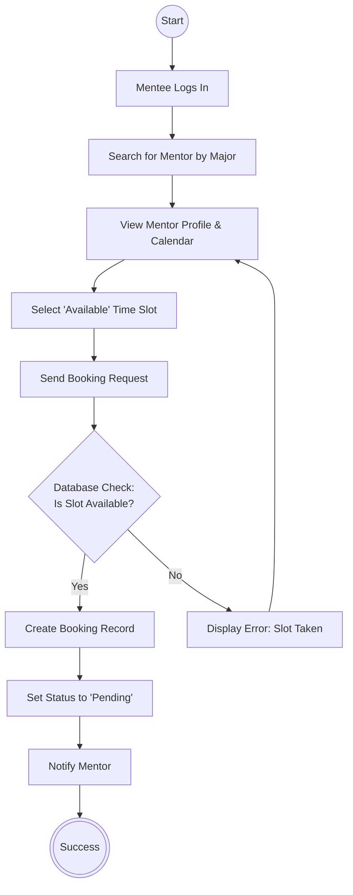

# 🔄 Mentee Booking Activity Diagram

This Activity Diagram models the behavioral workflow of a Mentee searching for a Mentor and requesting a booking, detailing the database validations and path bifurcations for successful bookings or conflicts.

---
### Workflow Step-by-Step

1. **Authentication**: The Mentee logs into their account on the PMU-Mentorship portal.
2. **Search**: The Mentee queries the database to filter active Mentors based on major or expertise.
3. **Selection**: The Mentee reviews the profiles and calendar availability of their selected Mentor, chooses a slot, and submits a booking request.
4. **Validation Check**: The system validates availability in real time to prevent race conditions.
   - **Conflict**: If the slot was booked in the interim, an error is shown, and the Mentee is returned to the Mentor profile page.
   - **Success**: If free, a new booking transaction record is initiated, setting status to `Pending` and triggering a notification to the Mentor.