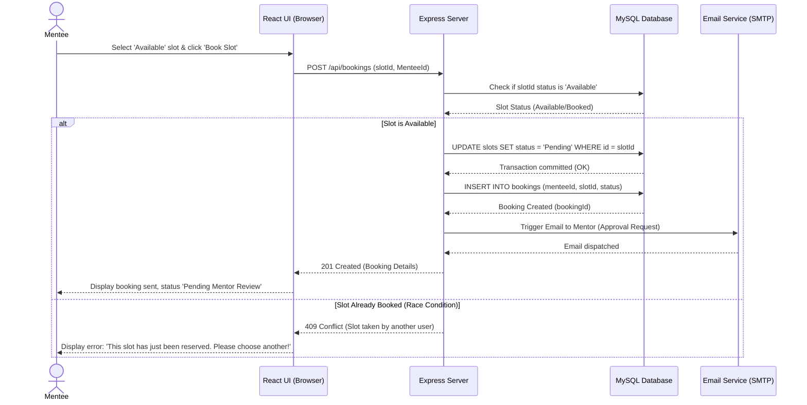

# 📅 Mentee Booking Sequence Diagram

This UML Sequence Diagram tracks the interactive messaging flow of a Mentee reserving an available time slot. It illustrates authorization checks, real-time database slot reservation lockups, notification dispatch mechanisms, and handling of booking race conditions (conflicts).

---
### Messaging Flow Explanation

1. **Reservation Action**: The Mentee browses the Mentor's calendar and requests to reserve a slot.
2. **REST Call**: The client app triggers an asynchronous HTTPS POST request containing credentials and the specific `slotId`.
3. **Database Check**: The backend initiates a transactional query to verify if the slot status remains `Available`.
4. **Conditional Flows (`alt/else`)**:
   - **Path A (Available)**: The backend initiates a database write lock, updates the slot's state to `Pending`, inserts a new booking record, triggers a notification to the Mentor via SMTP, and returns a successful response.
   - **Path B (Race Condition / Locked)**: If another user reserved the slot, the database returns a blocked state. The backend immediately returns a `409 Conflict` response to the client, preventing double bookings.
