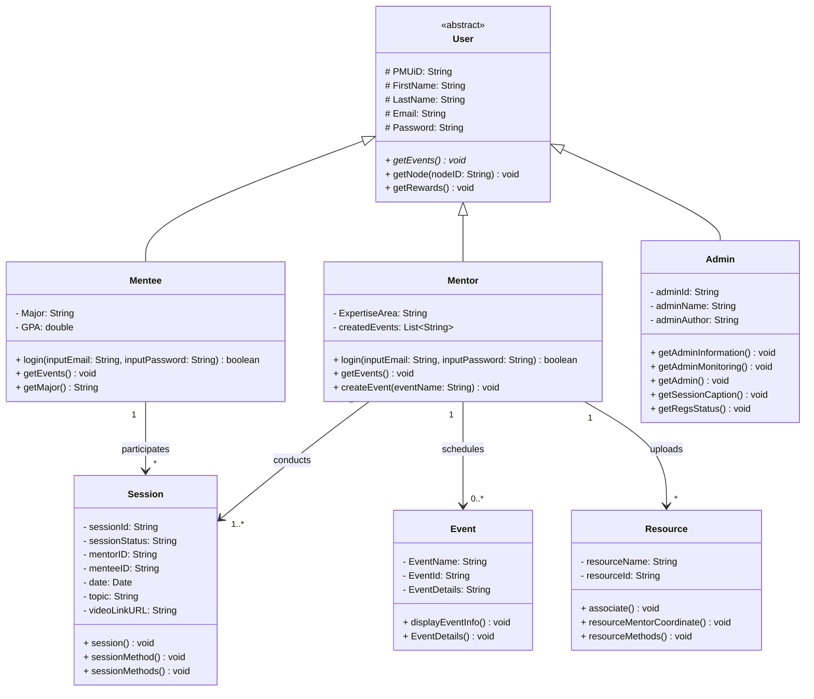

# 🗂️ PMU-Mentorship UML Class Diagram

This Class Diagram represents the domain model and structural blueprint of the PMU-Mentorship application. It illustrates the object-oriented design, including inheritance hierarchies from the base abstract `User` class to the concrete roles (`Mentee`, `Mentor`, `Admin`), as well as relationship multiplicities between core entities like `Session`, `Event`, and academic `Resource`.

---
### Object-Oriented Principles Demonstrated

1. **Inheritance (Generalization)**:
   - `User` is an abstract base class that encapsulates common fields (`PMUiD`, `FirstName`, `LastName`, `Email`, `Password`) and defines the abstract signature `getEvents()`.
   - `Mentee`, `Mentor`, and `Admin` extend `User`, inheriting these properties while introducing specialized attributes and behaviors (e.g., `Mentee.Major`, `Mentor.ExpertiseArea`).

2. **Associations & Multiplicities**:
   - A `Mentee` participates in zero or more (`*`) `Sessions`.
   - A `Mentor` leads one or more (`1..*`) `Sessions`, publishes zero or more (`0..*`) `Events`, and uploads any number of educational `Resources`.