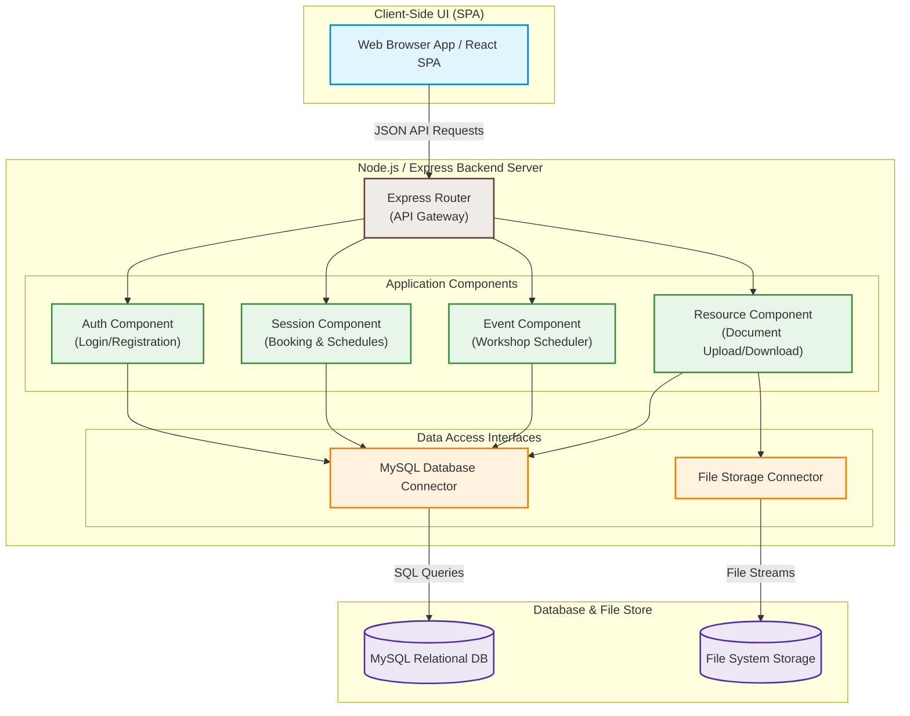

# 🧩 UML Component Diagram

This UML Component Diagram shows the modular structure of the PMU-Mentorship application, displaying how separate software components (Frontend SPA, Auth, Session Manager, Event Manager, Resource Manager, and database/storage controllers) interact via defined interfaces and connectors.

---
### Architectural Components Explained

1. **Client-Side UI (SPA)**:
   - Built using React.js, providing an interactive dashboard. Communicates with the backend exclusively via HTTPS asynchronous API calls sending/receiving JSON payloads.
2. **Express Router**:
   - The entryway of the application server (API Gateway) that handles request dispatching, authentication token verification (JWT), and rate-limiting.
3. **Application Components (Services Layer)**:
   - **Auth Component**: Verifies user logins and signs JWT credentials.
   - **Session Component**: Manages calendars, creates slot bookings, and triggers slot status transitions.
   - **Event Component**: Handles student workshops and group tutoring reservations.
   - **Resource Component**: Manages file system descriptors, associating uploaded PDF slide sets with respective mentors.
4. **Data Access Interfaces**:
   - Decoupled modules that manage persistence logic. The `DBConnector` pool handles MySQL queries, while the `FileConnector` handles raw binary byte streams for local or cloud file systems.
