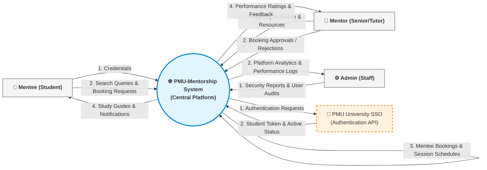

# 🌐 System Context Diagram (DFD Level 0)

This System Context Diagram (Data Flow Diagram Level 0) establishes the functional boundaries of the PMU-Mentorship platform. It treats the entire system as a singular central process node, displaying the data inputs, query structures, and response outputs exchanged with all external entities (Mentees, Mentors, Admins, and the external PMU SSO Identity Provider).

---
### Interfaces & Information Exchange Flows

1. **Student / Mentee**:
   - Sends: Login credentials, search queries (for academic topics or specific mentor profiles), and session reservation requests.
   - Receives: Profiles of matching mentors, booking notifications, downloadable study resources, and calendar reminders.
2. **Senior / Mentor**:
   - Sends: Custom schedules (available hours), approved/rejected booking states, resource files, and interactive chat text.
   - Receives: Booking requests, session details, calendar synchronizations, and ratings/feedback metrics.
3. **University Admin**:
   - Sends: System configuration updates, user blocklists, and system auditing queries.
   - Receives: Operational reporting, system health analytics, database audits, and security metrics.
4. **PMU University SSO Identity Provider**:
   - Interfaces via standard OAuth2 protocols. Receives verification requests, validating student details against university servers and returning active student status tokens.
