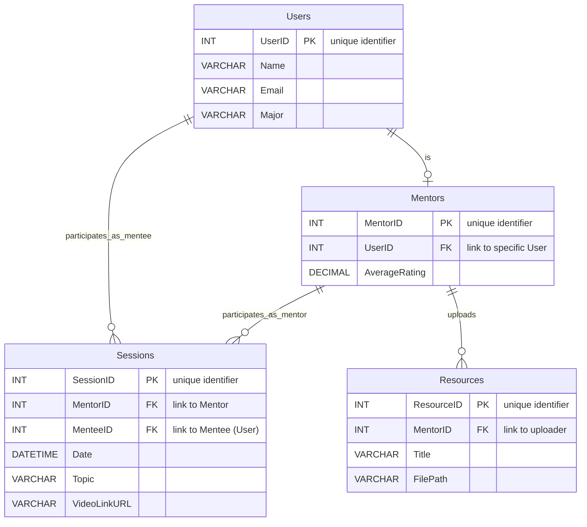

# 🛢️ PMU-Mentorship Entity-Relationship (ER) Diagram

This Entity-Relationship Diagram represents the relational database schema design for the PMU-Mentorship platform. It defines primary keys (PK), foreign keys (FK), column data types, and logical relationships ensuring data integrity and normalization.

---
### Schema Specifications

1. **Users Table**:
   - Stores general user data. Each user can potentially be promoted to a `Mentor` (1-to-0/1 relationship).
2. **Mentors Table**:
   - Holds specific attributes for mentors like ratings. Linked back to the `Users` table via a Foreign Key (`UserID`).
3. **Sessions Table**:
   - Represents a scheduled booking between a `Mentor` (FK to `Mentors`) and a `Mentee` (FK to `Users`).
4. **Resources Table**:
   - Contains uploads of files/documents by `Mentors`. Stores absolute document reference pathing (`FilePath`).