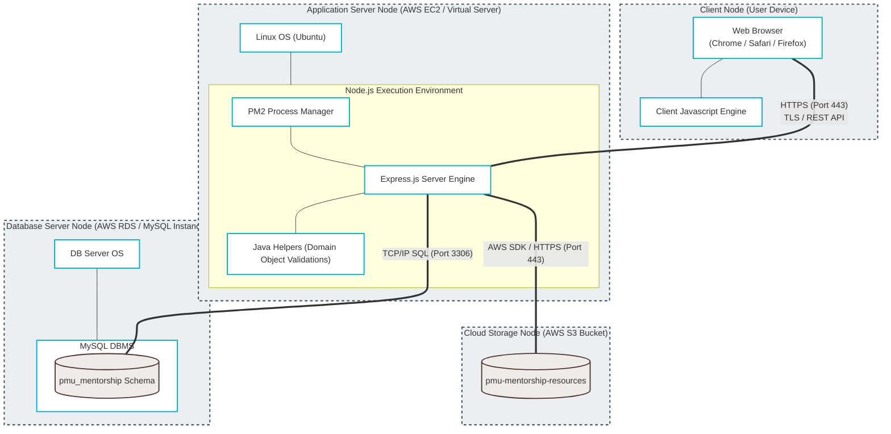

# 🖥️ UML Deployment Diagram

This UML Deployment Diagram maps the physical execution nodes (User Devices, Application Servers, Database Instances, Cloud Buckets) and the networking protocols (HTTPS, TCP/IP SQL, AWS SDK) used to host and scale the PMU-Mentorship application.

---
### Physical Infrastructure Breakdown

1. **Client Node (User Desktop or Mobile)**:
   - Contains standard modern browsers interpreting frontend React assets, running inside a secure sandbox client-side.
2. **Application Server Node (AWS EC2 / VPS)**:
   - Hosts a Linux OS running Node.js. PM2 manages process uptime. Express.js acts as the server runtime engine, integrating Java helper scripts (e.g. backend validation objects).
3. **Database Server Node (AWS RDS / Managed MySQL)**:
   - A dedicated server instance running a hardened Database Management System (DBMS) to optimize query read/write loads securely.
4. **Cloud Storage Node (AWS S3)**:
   - Handles scalable, static binary objects (like PDF slides or document templates uploaded by Mentors) separately, reducing core disk-space overhead on the app server.
