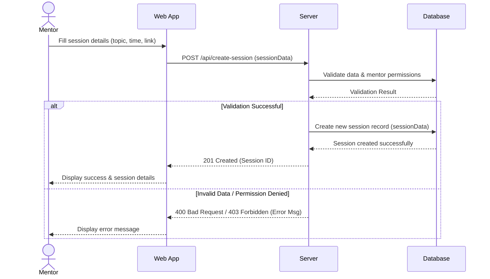

# 💬 Session Creation Sequence Diagram

This Sequence Diagram illustrates the step-by-step communication flow and API lifecycle when a Mentor creates a new mentorship session, demonstrating validation checks, database transactions, and alternative failure routing.

---
### Interaction Flow Detailed

1. **Input**: The Mentor fills out session details on the Web App frontend, supplying a topic, date/time slot, and meeting connection link.
2. **Request Dispatch**: The Web App packages these details as a JSON payload and makes an HTTP POST request to the API backend.
3. **Database Validation**: The Backend Server validates the inputs and checks whether the Mentor holds necessary role permissions.
4. **Conditional Branches (`alt/else`)**:
   - **Path A (Success)**: A SQL insert transaction creates the record, returning a success HTTP `201 Created` status code, updating the Mentor's schedule view.
   - **Path B (Failure)**: In case of validation issues (e.g., overlapping slot or missing token), the backend stops execution, sends a `400 Bad Request` or `403 Forbidden` response, and displays a user-friendly error message.