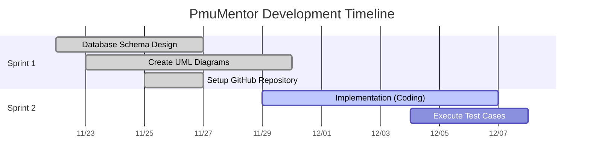

# 📅 Sprint Timeline & Development Gantt Chart

This Gantt Chart maps the development timeline and milestones for the PMU-Mentorship software project, covering Sprint 1 (Analysis & Design) and Sprint 2 (Implementation & Testing).

---
### Agile Sprint Structure

1. **Sprint 1 (Analysis & Design)**:
   - Focused on structural alignment. The database schema design, system documentation, UML blueprints, and collaborative environment (GitHub setup) were finalized.
2. **Sprint 2 (Implementation & Execution)**:
   - Concentrates on active development cycles, system coding integration, and writing and executing automated/manual test cases to ensure reliability before release.