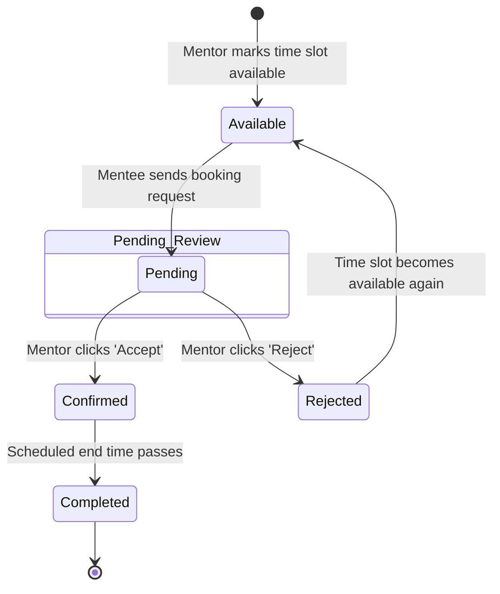

# 🚦 Booking Slot State Machine Diagram

This State Machine Diagram tracks the lifecycle states of a mentorship booking slot, illustrating how actions taken by Mentors and Mentees transition a booking from inception to completion.

---
### Lifecycle States Breakdown

1. **Available**: The initial state when a Mentor registers free time slots in their calendar.
2. **Pending (Under Review)**: A Mentee has requested this specific slot. It is locked from further requests while the Mentor evaluates the booking.
3. **Confirmed**: The Mentor accepted the request. The session is scheduled to take place.
4. **Rejected**: The Mentor declined the request. The slot transitions back to `Available` so other Mentees can view and request it.
5. **Completed**: The scheduled session concludes, completing the slot's active lifecycle.