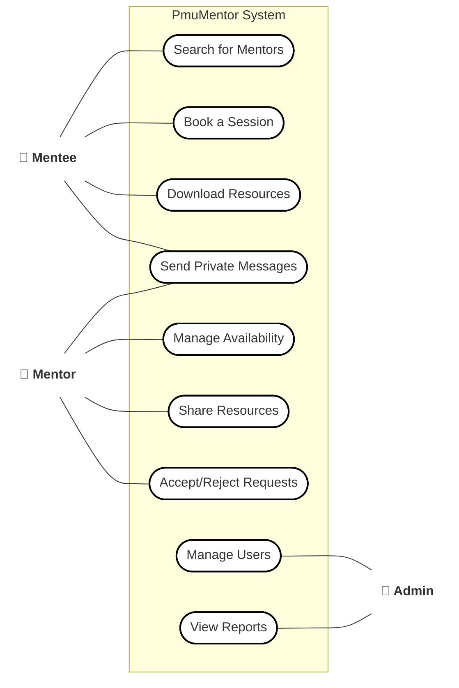

# 🎯 PMU-Mentorship System Use Case Diagram

This Use Case Diagram depicts the system boundary and roles of actors (**Mentee**, **Mentor**, and **Admin**) interacting with the various modules of the PMU-Mentorship application.

---
### Actors & Operational Scopes

1. **Mentee (Student)**:
   - Primary operations: Searching for active peer mentors by major, booking time slots, reviewing academic files/study guides, and exchanging messages.
2. **Mentor (Senior/Tutor)**:
   - Primary operations: Creating session slots, approving or declining incoming booking requests, uploading study files, and chatting with mentees.
3. **Admin (University Staff)**:
   - Primary operations: Overall system administration, user management (suspending/registering), and generating/viewing metrics and reports.