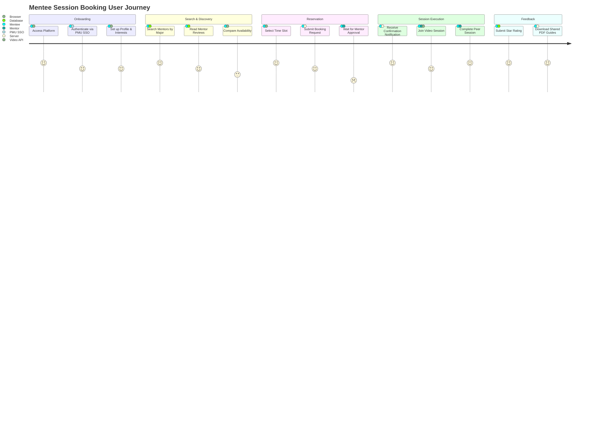

# 🗺️ Mentee User Journey Map

This User Journey Map represents the lifecycle of a student's (Mentee) interaction with the PMU-Mentorship platform. It details user actions, satisfaction scores (emotional states from 1 to 5), and platform touchpoints across five distinct phases: Onboarding, Search, Reservation, Session, and Feedback.

---
### Phase Analysis & System Highlights

1. **Onboarding**:
   - *Experience*: Easy entry via single-sign-on (SSO), building immediate confidence.
   - *Touchpoints*: SSO interface, initial profile interest checklist.
2. **Search & Discovery**:
   - *Experience*: Highly satisfying due to instant filtering by major, though finding a match depends on availability (satisfaction drops slightly during date comparison).
   - *Touchpoints*: Search controller, mentor listing cards.
3. **Reservation (The Waiting Period)**:
   - *Experience*: Tension points occur while the Mentee awaits approval from the Mentor (satisfaction dips to 2). This highlights the system need for active notification systems to reduce latency.
   - *Touchpoints*: Booking API transaction, approval emails.
4. **Session Execution**:
   - *Experience*: Maximum value delivered! Peer tutoring session occurs on-platform, resolving academic questions.
   - *Touchpoints*: Video meeting interface, whiteboard sharing.
5. **Feedback & Resources**:
   - *Experience*: High satisfaction closing loop. The student rates the tutor and downloads study guide handouts.
   - *Touchpoints*: Stars selection review form, S3 PDF resource manager.
